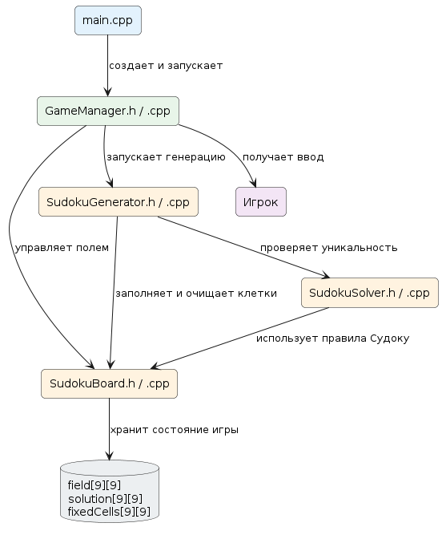
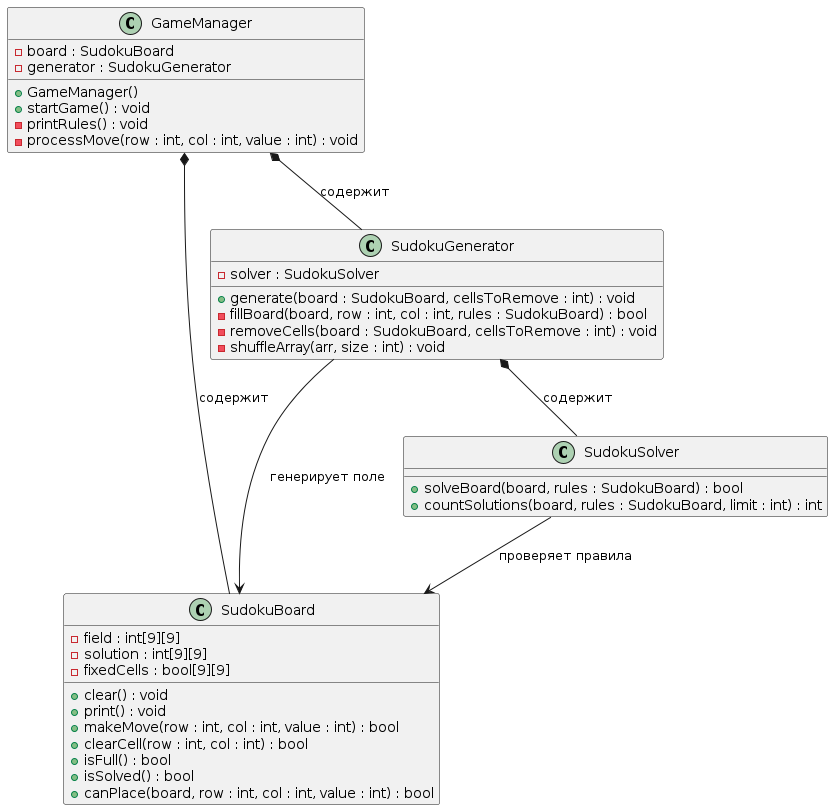
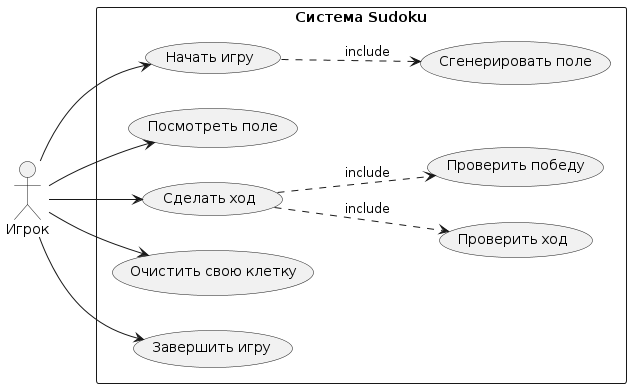
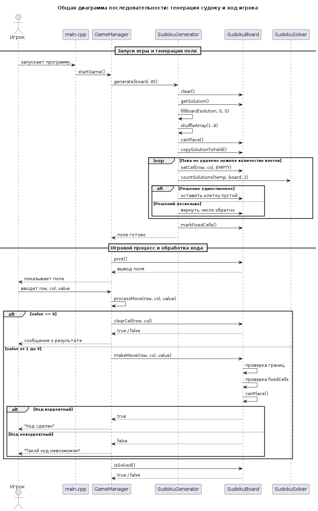
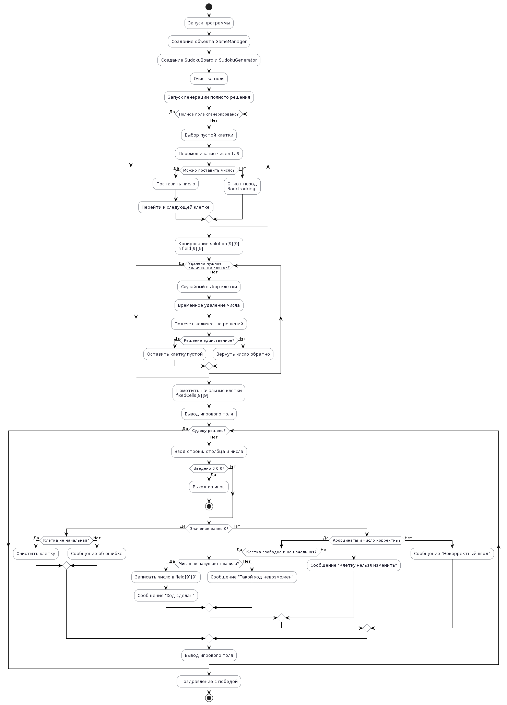

# Проект: игра Судоку на C++

## Файлы проекта

- `Sudoku.h` — описание класса `Sudoku`
- `Sudoku.cpp` — реализация методов класса
- `main.cpp` — игровой цикл

## Что реализовано

1. Поле 9x9.
2. Проверка строк, столбцов и квадратов 3x3.
3. Игра через консоль.
4. Игрок не может изменять изначальные клетки.
5. Можно очистить свою клетку, введя строку, столбец и `0`.
6. Поле не захардкожено как одна готовая задача:
   - сначала случайно генерируется полное правильное решение;
   - генерация выполняется рекурсивным алгоритмом backtracking;
   - затем случайно удаляется часть клеток;
   - после каждого удаления проверяется, что у судоку осталось единственное решение.

## UML-диаграммы

## Диаграмма структуры
[Открыть PlantUML-файл](docs/puml/01_project_structure.puml)


### Диаграмма классов

[Открыть PlantUML-файл](docs/puml/02_class_diagram.puml)



### Диаграмма вариантов использования

[Открыть PlantUML-файл](docs/pml/03_use_case_diagram.puml)



### Диаграмма последовательности

[Открыть PlantUML-файл](docs/puml/05_move_sequence_diagram.puml)



### Диаграмма активности

[Открыть PlantUML-файл](docs/puml/04_activity_diagram.puml)



## Сборка через g++

```bash
g++ main.cpp Sudoku.cpp -o sudoku