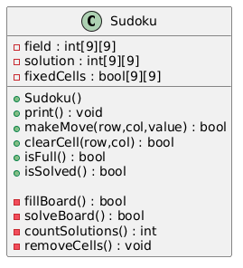
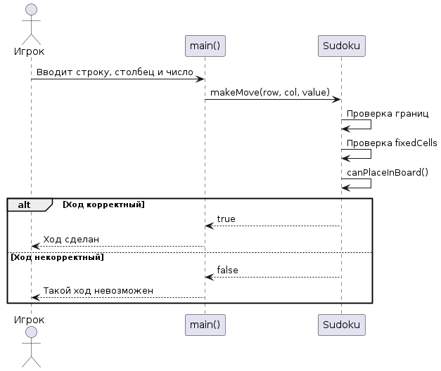
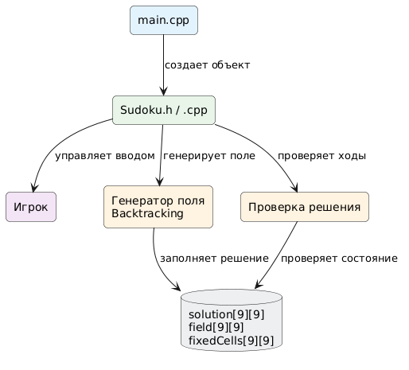
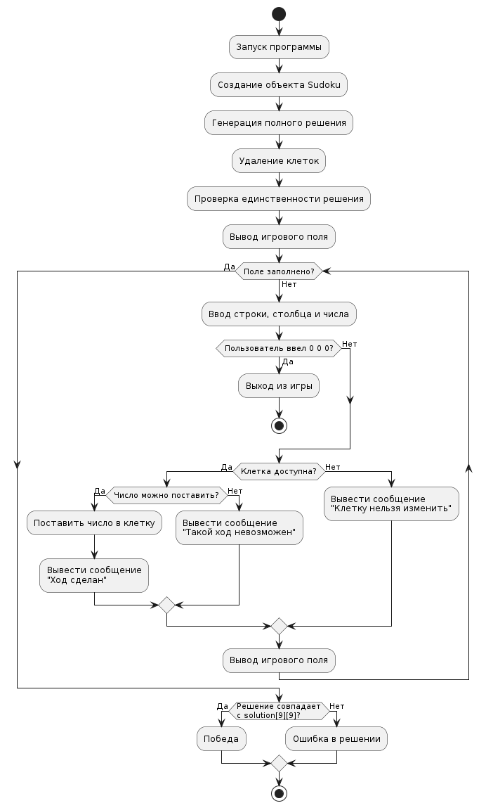
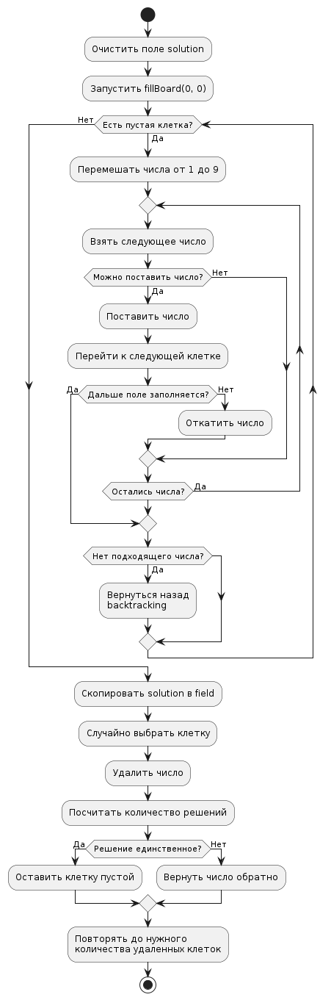
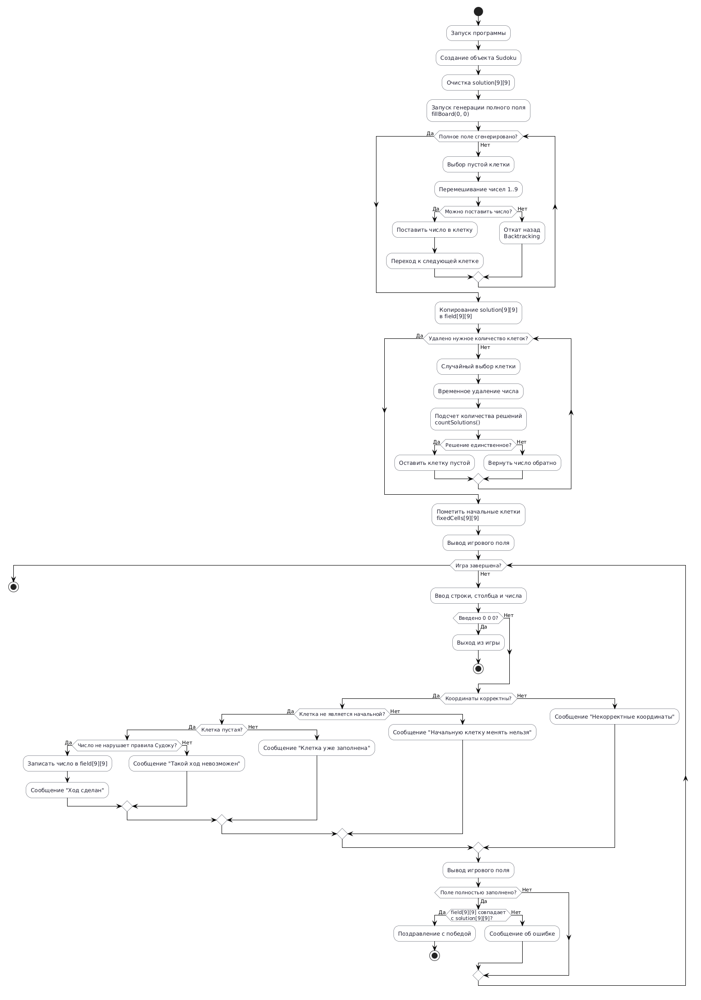

Проект: игра Судоку на C++

Файлы:
- Sudoku.h      описание класса Sudoku
- Sudoku.cpp    реализация методов класса
- main.cpp      игровой цикл

Что реализовано:
1. Поле 9x9.
2. Проверка строк, столбцов и квадратов 3x3.
3. Игра через консоль.
4. Игрок не может изменять изначальные клетки.
5. Можно очистить свою клетку, введя строку, столбец и 0.
6. Поле не захардкожено как одна готовая задача:
   - сначала случайно генерируется полное правильное решение;
   - генерация выполняется рекурсивным алгоритмом backtracking;
   - затем случайно удаляется часть клеток;
   - после каждого удаления проверяется, что у судоку осталось единственное решение.

Сборка через g++:
g++ main.cpp Sudoku.cpp -o sudoku

Запуск:
./sudoku

Для Windows:
g++ main.cpp Sudoku.cpp -o sudoku.exe
sudoku.exe

## UML Diagram

Исходный код диаграммы:
[ClassDiagram.puml](docs/puml/ClassDiagram.puml)

Исходный код диаграммы:
[PosledDiagram.puml](docs/puml/people.puml)

Исходный код диаграммы:
[PosledDiagram.puml](docs/puml/StructureProgect.puml)

Исходный код диаграммы:
[PosledDiagram.puml](docs/puml/MainPosled.puml)

Исходный код диаграммы:
[PosledDiagram.puml](docs/puml/MainPosled.puml)

Исходный код диаграммы:
[PosledDiagram.puml](docs/puml/PosledDiagram.puml)
